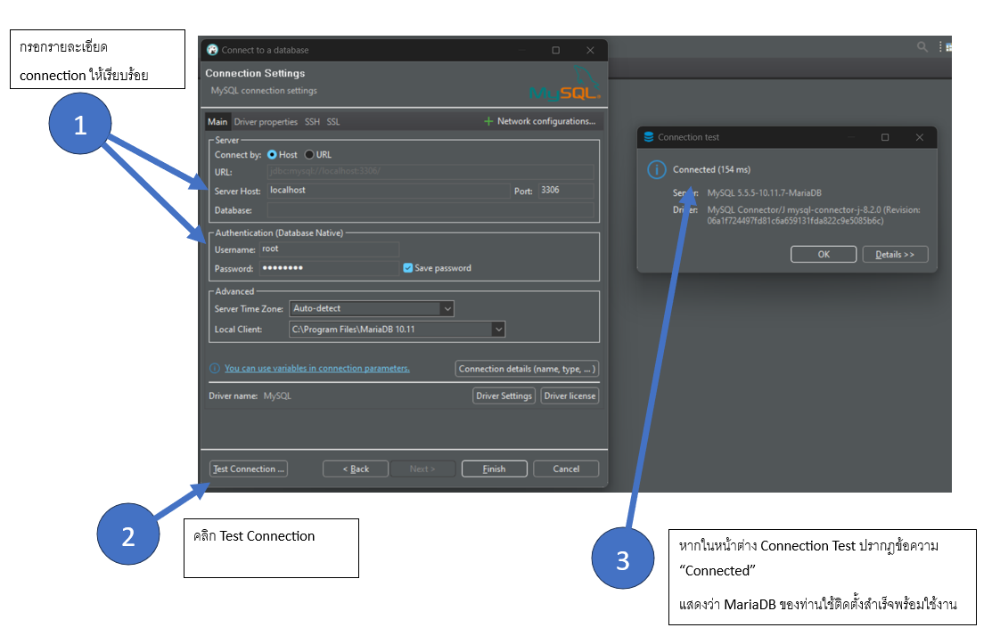

## 1. จะรู้ได้ยังไงว่า MariaDB ติดตั้งสำเร็จพร้อมใช้งาน

ให้เข้าโปรแกรม DBeaver แล้ว New Database Connection หากได้หน้าจอตามภาพนี้ แสดงว่าการติดตั้ง MariaDB สำเร็จ พร้อมใช้งานครับ

## 2. ถ้ามีโปรแกรม Database อื่นอยู่แล้ว ไม่ติดตั้ง MariaDB ได้ไหม

คำตอบ คือ ได้ครับ

หากติดตั้งตัวใดตัวหนึ่งในรายชื่อนี้
1. MySQL 
2. XAMPP (ซึ่งติดตั้ง MariaDB มาด้วย)

## 3. Local Client ในโปรแกรม DBeaver เลือกเป็นตัวไหน

คำตอบ คือ แนะนำให้เลือก ตัวใดตัวหนึ่ง ระหว่าง "MySQL Binaries" หรือ "MariaDB" ครับ
